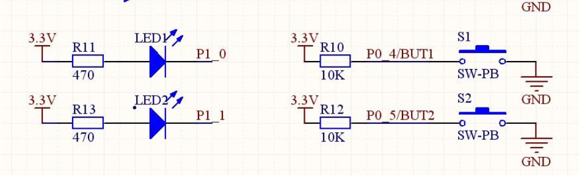

- Tags: #CC2530 
- Date: 2022-04-30
---



## Register review
![[../../Register/Interrupt-related-registers]]

## source code
```c
#include <ioCC2530.h>
#define uint unsigned int
#define uchar unsigned char

#include LED1 P1_0
#include KEY1 P0_4

void Delayms(uint);
void InitLed(void);
void KeyInit();
uchar KeyValue=0
```

![[按键控制LED#delay function]]

### led initialization
``` c
void InitLed(void)
{
	P1DIR |= 0x01;
	LED1 = 1;
}
 ```
### interrupt initialization
```c
void InitKey()
{
	P01EN |= 0x10 // P0_4 set to interrupt mode
	PICTL |= 0x01 // falling edge trigger
	IEN1 |= 0x20 // Enable P0 port interrupt
	POIFG = 0x00 // Initialize interrupt flag
	EA = 1 // open total interrupt
}
```

### interrupt handler func
```c
#pragma vector = POINT_VECTOR //format: #pragma vector = interrupt vector
   // then interrupt handler func
 __interrupt void P0_ISR(void)
 {
	Delayms(10); // debounce
	LED1 = ~LED1; // change LED1 state
	P0IFG = 0; // clear interrupt flag
	P0IF = 0; // clear interrupt flag
 }
```

### main func 
```c
void main(void)
{
	InitLed();
	InitKey;
	while(1); // wait for external interrupt
}
```
