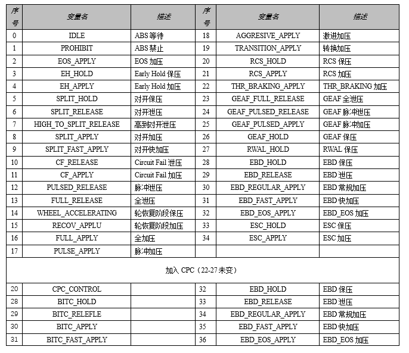

# ABS control state



### Calculate `ABS_whl.t_yc_dump_copy_intrrpt_tim_s16`

```c
if(
    ( ABS_whl[].dump_torq change percent < ABS_whl[].yc_dump_perc_copied_S16 
    &&Abs_input.WhiPresEst[]> AC_PESTIDB_DB)//1 
  ||(ABS_whl[].rel_time_sum < ABS_whl[].yc_dumptim_copied_s16) 
  || control_state[CURRENT] != control_state [BEFORE]
  ) 
&&(
    oppwhl.slip_phase = SLIP_UNDER_THR
  ||oppwhl.control_state [CURRENT] == ACTION ESC HOLD
  ||oppwhl.control_state [CURRENT] == ACTION_ESC_APPLY
  ||h2s_caused_by_u8 == H2S_BY_FAST_YAW //4
  )
else if ABS_whl.t_yc_dump_copy_intrrpt_tim_s16 <= S16_MAX_ABS_LOOPTIME
{
  ABS_whl.t_yc_dump_copy_intrrpt_tim_s16 = ABS_LOOPTIME //5
}
```