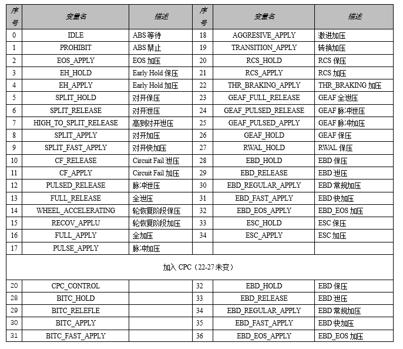

# ABS control state

### ABS_veh.ab_di_desense
- ABS_NO_DESENS 0
- ABS_LIGHT_DESENS 1
- ABS_HEAVY_DESENS 2

### ABS_CYCLE_STATUS_TYPE_TAG (ABS_whl[].slip_phase)
- SLIP_ABOVE_THR 0
- SLIP_UNDER_THR 1
- SLIP_PHASE_TRANS 2
- SLIP_PHASE_TRANS_CONFIM 3

### ABS_veh.rear_control_mode
- REAR_INDEPENDENT 0
- REAR_SELECT_LOW 1
- REAR_PHASE_SHIFT_LEFT 2
- REAR_PHASE_SHIFT_RIGHT 3

### ABS_whl[].whl_surf_jump_state
- WHL_NO_TRANSITION 0
- WHL_L2H_TRANSITION 1
- WHL_H2L_TRANSITION 2

### ABS_veh.surface_condition
- SURFACE_UNKOWN 0
- SURFACE_HOMOGENEOUS 1
- SURFACE_SPLIT_RIGHT_HIGH_PENDING 2
- SURFACE_SPLIT_LEFT_HIGH_PENDING 3
- SURFACE_SPLIT_RIGHT_HIGH_CONFIRMED 4
- SURFACE_SPLIT_LEFT_HIGH_CONFIRMED 5

### ABS_veh.surface_transition_state_u8
- SURF_TRANS_NO_TRANSITION 0
- SURF_TRANS_HIGH_TO_LOW 1
- SURF_TRANS_LOW_TO_HIGH 2
- SURF_TRANS_HIGH_TO_RIGH_HIGH 3
- SURF_TRANS_HIGH_TO_LEFT_HIGH 4
- SURF_TRANS_LOW_TO_RIGHT_HIGH 5
- SUEF_TRANS_LOW_TO_LEFT_HIGH 6
- SURF_TRANS_RIGHT_HIGH_TO_HIGH 7
- SURF_TRANS_LEFF_HIGH_TO_HIGH 8
- SURF_TRANS_RIGHT_HIGH_TO_LOW 9
- SURF_TRANS_LEFT_HIHG_TO_LOW 10
- SURF_TRANS_POSSIBLE_LEFT_HIGH 11
- SURF_TRANS_POSSIBLE_RIGHT_HIGH 12
- SURF_TRANS_CONFIRM_LEFT_HIGH 13
- SURF_TRANS_CONFIRM_RIGHT_HIGH 14
- SURF_TRANS_CONFIRM_HOMOGENEOUS 15

### ABS_veh.h2s_caused_by_u8
- H2S_NOT_DETECTED 0
- H2S_BY_AX_NEG_PEAK 1
- H2S_BY_AX_POS_PEAK 2
- H2S_BY_DELTA_DUMPTIME 3
- H2S_BY_FAST_YAW 4
- H2S_BY_SLOW_YAW 5
- H2S_BY_PDIFF 6

### Tcs_axle[].pt_torq_request_mode
- PTC_EXIT 0
- PTC_INITIAL 1
- PTC_NORMAL  2
- PTC_RAMPOUT 3
- PTC_STATE_MAX 4

### Tcs_input.drivetrain
- FWD 0
- AWD 1
- NEUTRAL 2
- HIGH_RANGE_4x4 3
- LOW_RANGE_4x4 4
- AWD 5
- AWD_RANGE 6

### Tcs_axle[].slip_state
- STATE_STABLE 0
- STATE_SPLIT 1
- STATE_HOMOGENEOUS 2

### Tcs_axle[].gain_scheduling
- GAIN_INITIAL 0
- GAIN_NORMAL 1
- GAIN_SPLIT 2
- GAIN_SCHEDULING_MAX 3

### Esc_upc.control_state
- S_UPC_DISABLE 0
- S_UPC_ACTIVE 1
- S_UPC_RAMPOUT 2
