# ASC/ECS简介

##### 名词
- ABS(Anti-Lock Brake System): 防抱死制动系统
- ESC(Electronic Stability Controller): 汽车电子稳定系统
- ESP(Electronic Stability Program): 车身电子稳定系统(同ESC,叫法不同)
- WCBS(Wire Controller Brake System): 线性控制制动系统
- CAN(Controller Area Network): 控制器局域网

---

| 产品 |       控制方式      |
|:----:|:-------------------:|
|  ABS |   ISO阀线性流控制   |
|  ESC | TC, ISO阀线性流控制 |

## ABS/ESC 系统构成
- ESC
- 轮速传感器
- 惯量传感器(IMU)
- 方向转角传感器(SAS)

## ABS
### ABS爆炸图
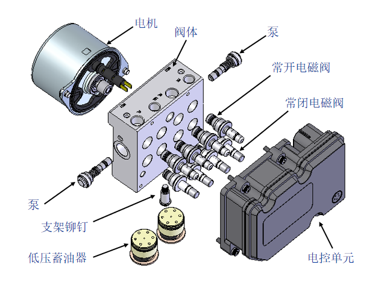

### ABS系统的组成及原理-液压回路工作图
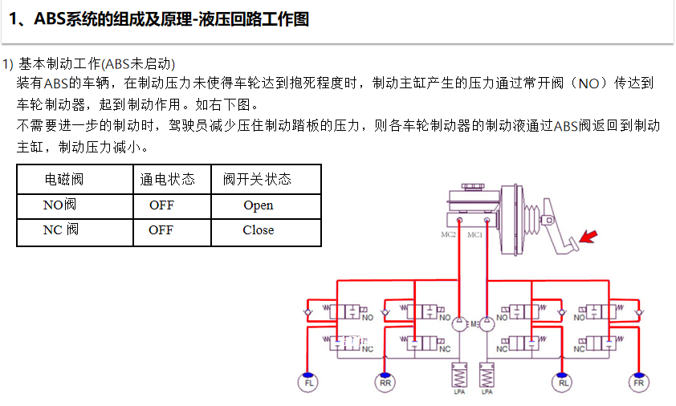

- MC: Master Cylinder 主缸
 
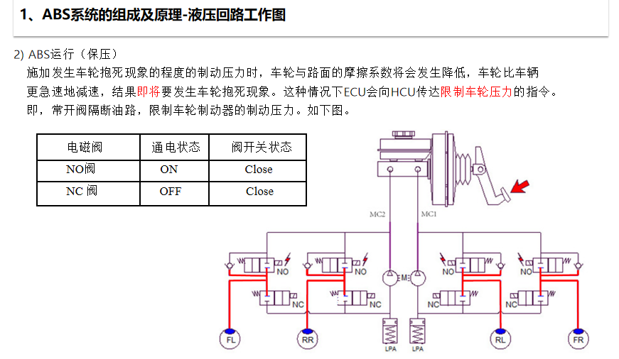 
 
- ECU: Electronic Controller Unit 电控单元
- HCU: Hybrid Combining Unit ABS执行机构

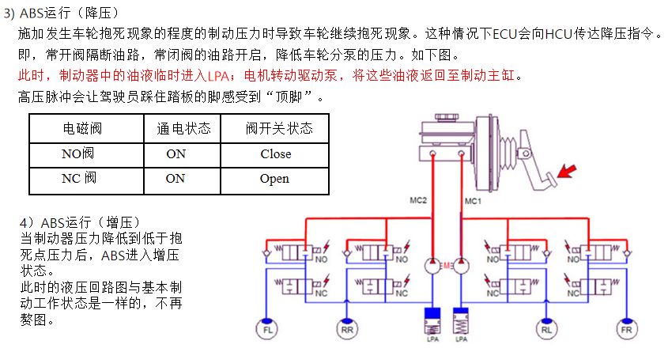 

- LPA: Low pressure oil accumulator 低压蓄油器

### ECS关闭开关策略
- 关闭ESC有助车辆通过深陷积雪和泥泞中
- 关闭ESC仅关闭TCS和ESC功能, 保留ABS功能

## ESC
### ECS爆炸图
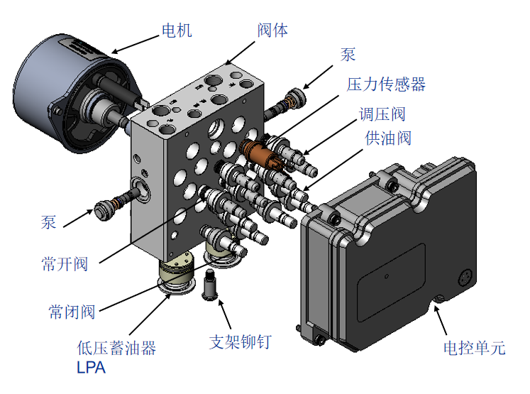 

### ESC系统的组成及原理-液压回路工作图
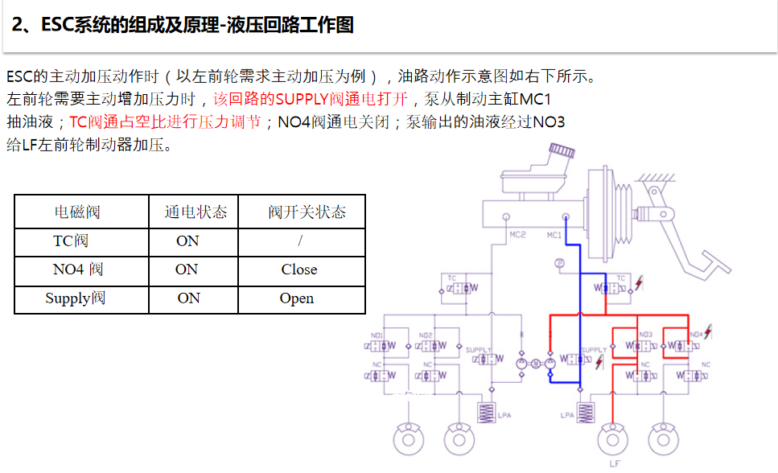

#### ESC主动刹车原理
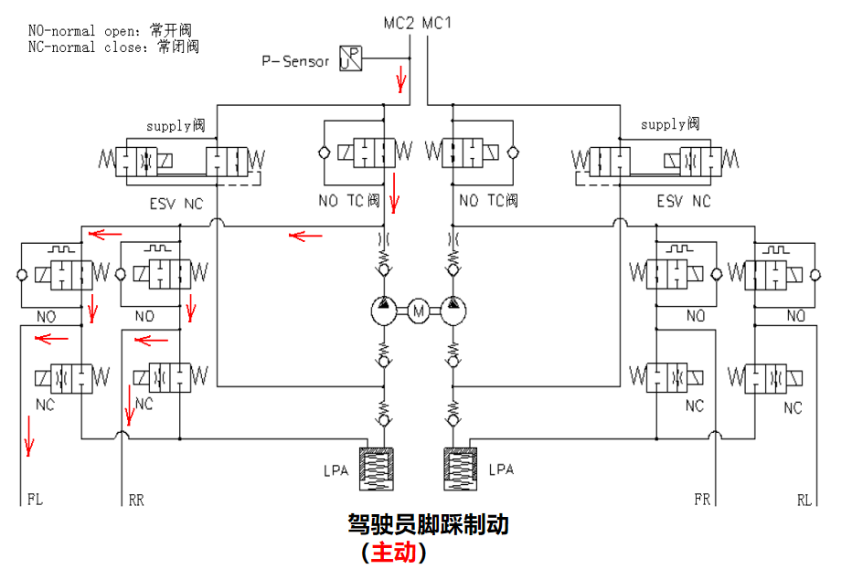

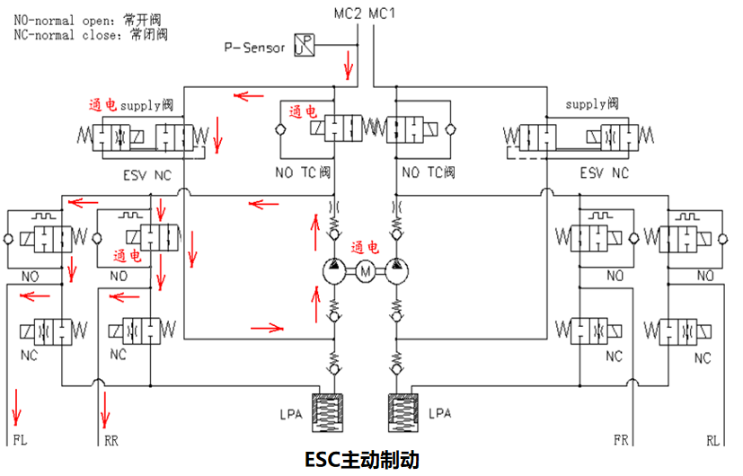

## ABS/ESC功能
- **VDC**(Vehicle Dynamics Control, 汽车动态控制系统): 解决行驶侧滑问题
- **TCS**(Traction Control System, 牵引力控制系统): 解决加速打滑问题
- **ABS**(Anti-Lock Brake System,防抱死刹车系统): 解决制动与转向问题
- **EBD**(Electronic Brake force Distribution, 电子制动力分配)
- **AUTOHOLD**(自动驻车)
- **HBA**(Hydraulic Brake Assist, 液压制动辅助系统)
- **HHC**(Hill Hold Control, 坡道辅助系统)
- **EDC**(Electric Diesel Control, 柴油喷射电子控制)

### ABS功能
**原理** : ABS在制动过程中,通过加压、保压、泄压控制实现车轮防抱死功能

**作用** 
- 防止制动时车轮抱死, 保证转向
- 保证车辆制动的稳定性
- 缩短制动距离

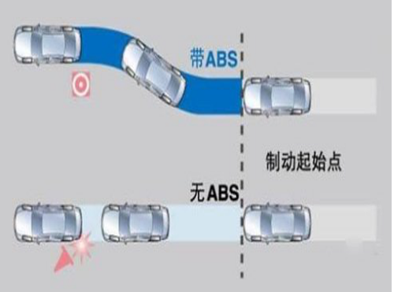

### TCS功能
**原理** :TCS在控制过程中,通过制动和降妞降低车辆驱动轮打滑,提升牵引力

**作用** 
- 降低车辆驱动轮打滑
- 增加整车牵引力
- 保证整车加速过程中的稳定性(*前轮打滑,整车失去方向,后轮打滑,整车失稳*)

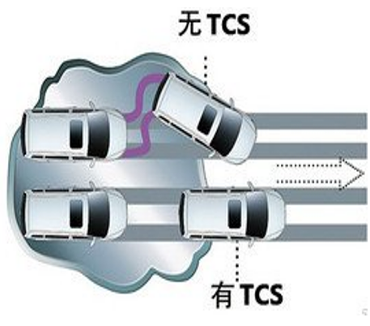

### VDC功能
**原理** : ESC在控制过程中,通过制动和驱动扭矩控制,达到消除车辆侧滑问题

**作用**
- 保证车辆行驶的循迹性
- 保证车辆行驶的稳定性(*后轮侧滑,车辆甩尾*)

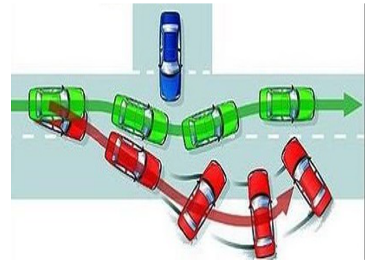

### EDC功能
**原理** : EDC在控制过程中响应EPB(Electrical Park Brake, 电子驻车制动系统)的制动请求,ESC迅速对四个车轮进行加压制动,控制到目标减速度

**作用**
- 迅速制动,制动距离短
- 可以扩展程其他功能,如:AEB(Autonomous Emergency Braking, 自动制动系统)

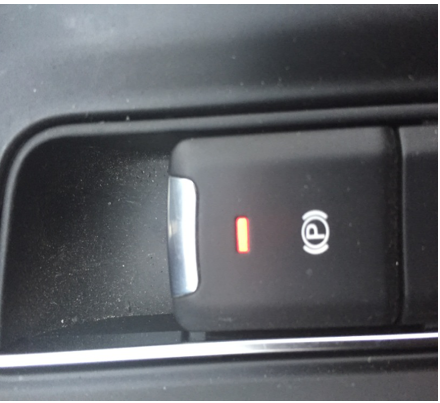

### HSA功能
**原理** : HSA(Hill Start Assist, 上坡起步助手)为车辆坡起控制,在上坡或倒坡时,松开制动踏板后,保持一定的压力

**作用**
- 在坡路上,帮助驾驶员顺利起步

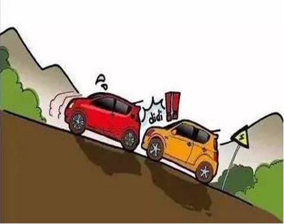

### HBA功能
**原理** : HBA为液压辅助制动,通过识别驾驶员踩下制动的速度,且制动力达到一定的值,识别出驾驶员紧急制动意图,ESC的马达主动加压辅助制动

**作用**
- 低的踏板制动力进入紧急制动,缩短制动反应时间,减小制动距离

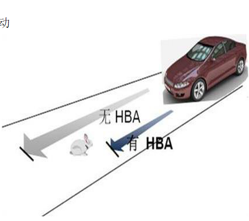
