# WCBS

**Wire Control Brake System** 线性控制制动系统

## 结构
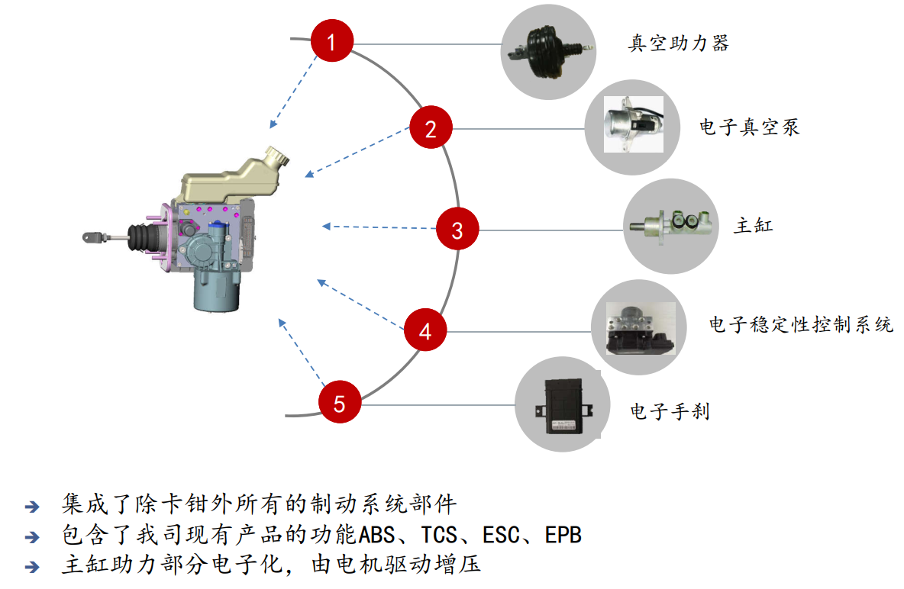

### 出现原因
- 真空源
	* 新能源汽车无稳定的真空源
- 节能
	1. 减重
	2. 配合驱动电机进行制动力调节
- 舒适性
	* [NVH](https://baike.baidu.com/item/NVH)(Noise, Vibration, Harshness)
	* 更好的踏板感
- 主动安全
	- AEB(Autonomous Emergency Braking, 自动制动系统), ACC(Adaptive Cruise Control, 自适应巡航控制系统)时需要主动建压

## 工作原理
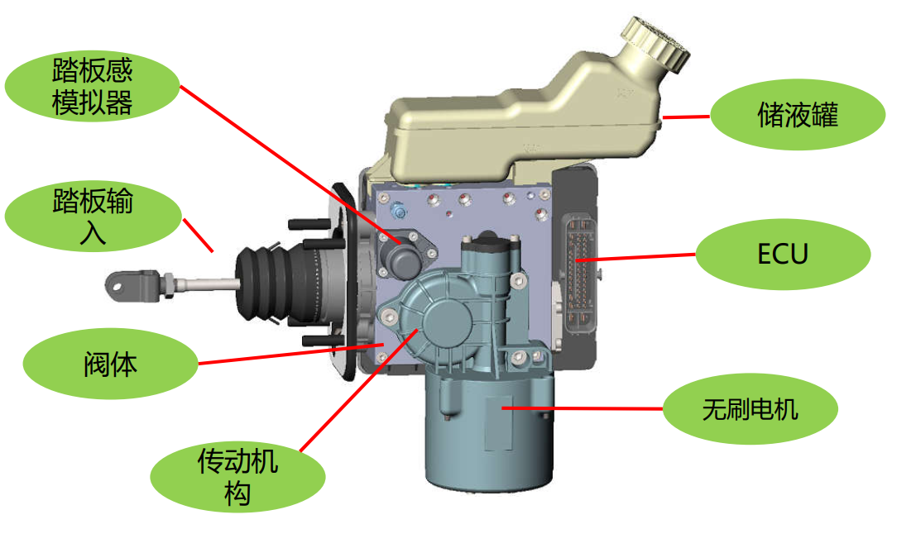 **总成布局**

### 爆炸图
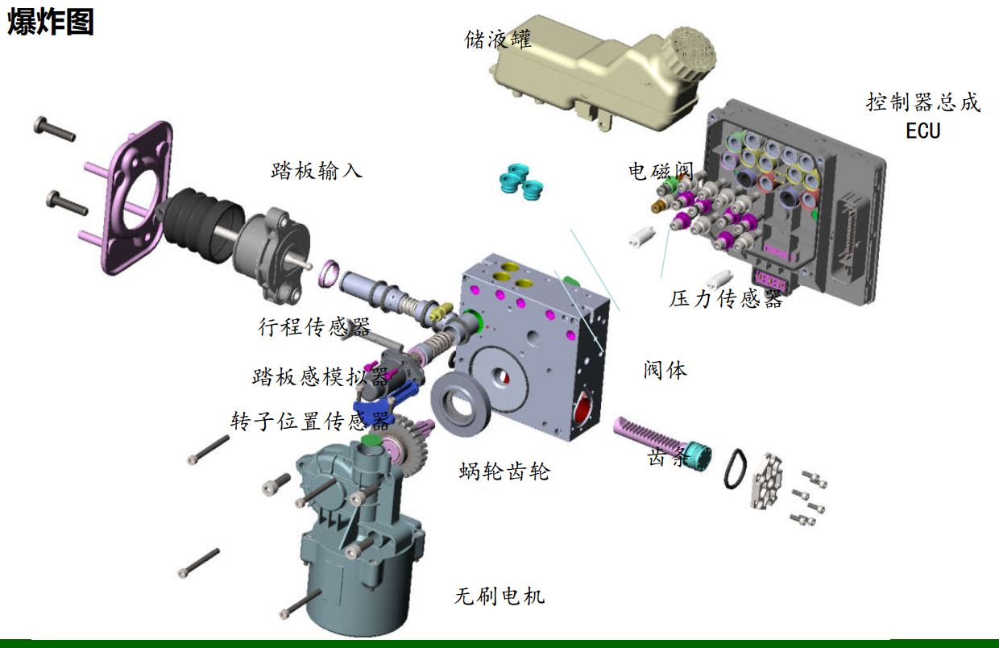

### 功能列表
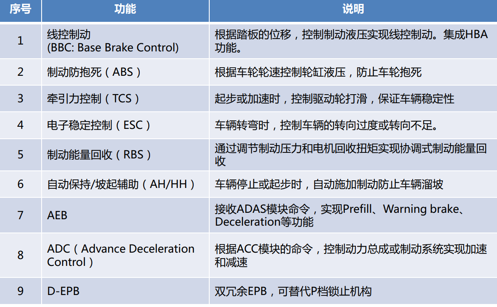

### 系统液压原理图
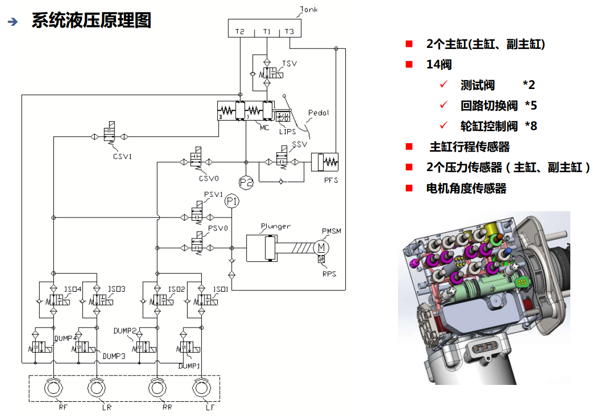

### 系统工作原理图
#### 常规制动工作原理图
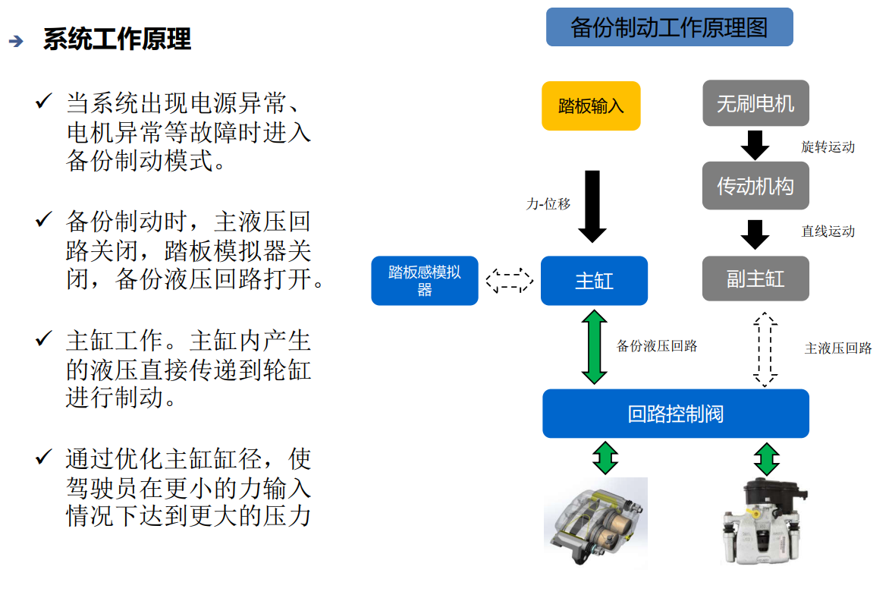

#### 备份制动工作原理图
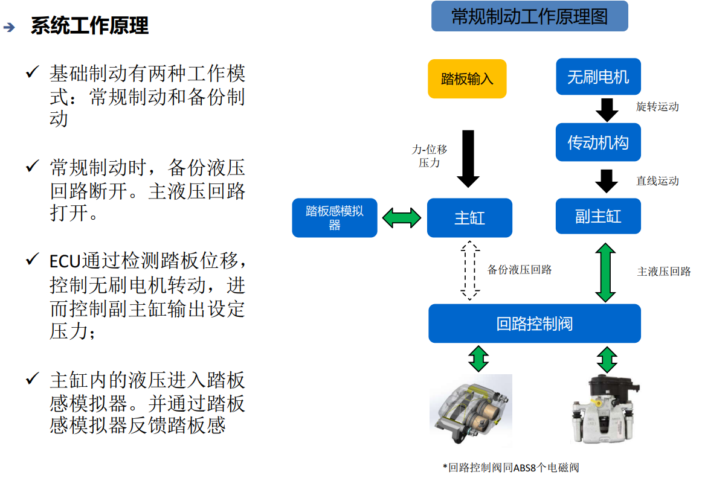

#### ABS功能,单轮液压回路原理
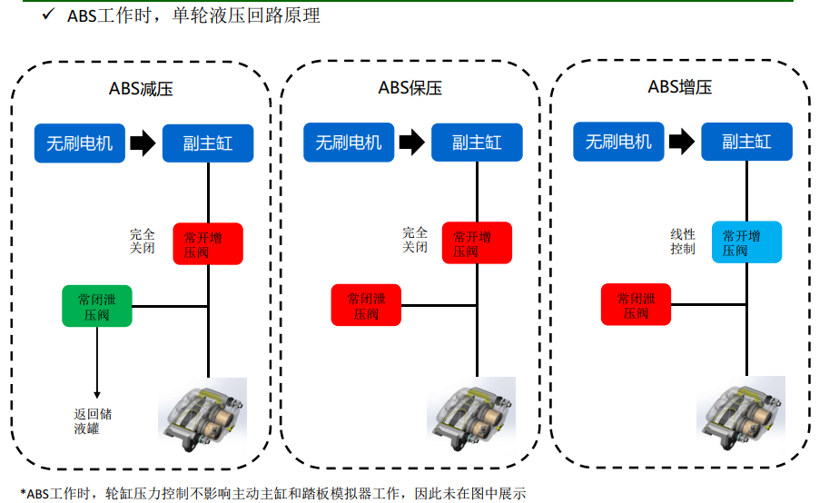

#### RBS能量回收功能
> RBS: Regenerative Braking System 再生刹车系统

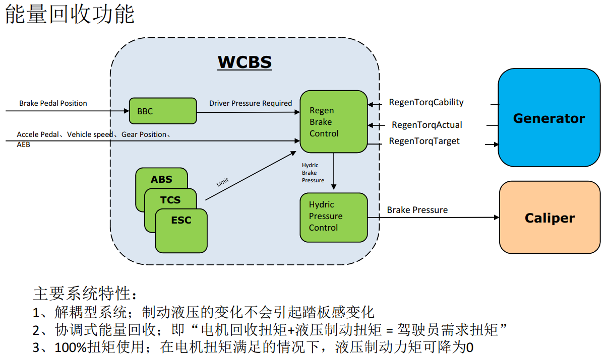
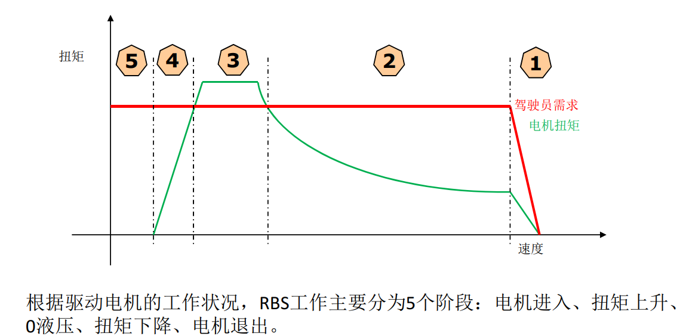

### 系统组成
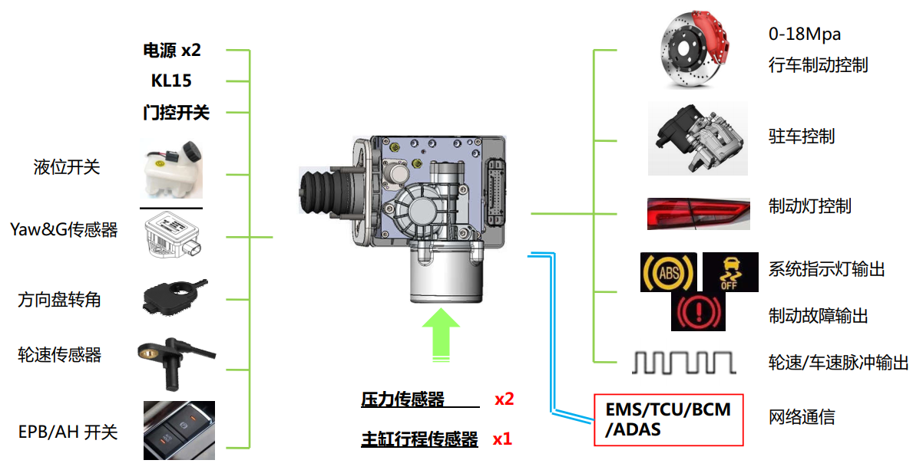

### WCBS优势
- 快速增压
- 制动能量回收
- 定制化的踏板感觉
- 系统高度集成
- 可靠性
- NVH性能
