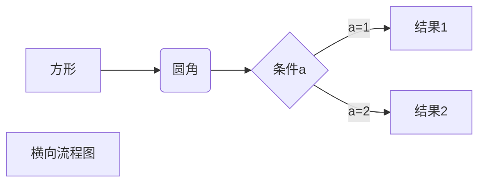
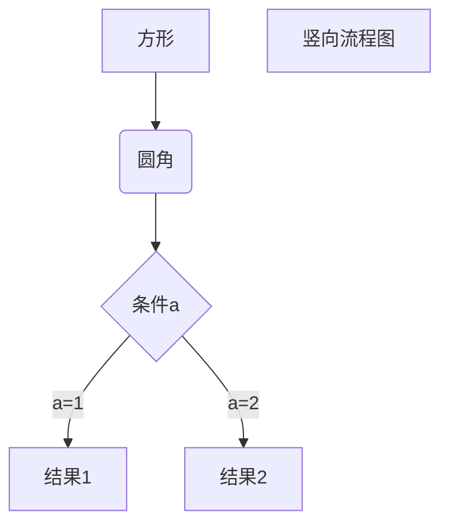
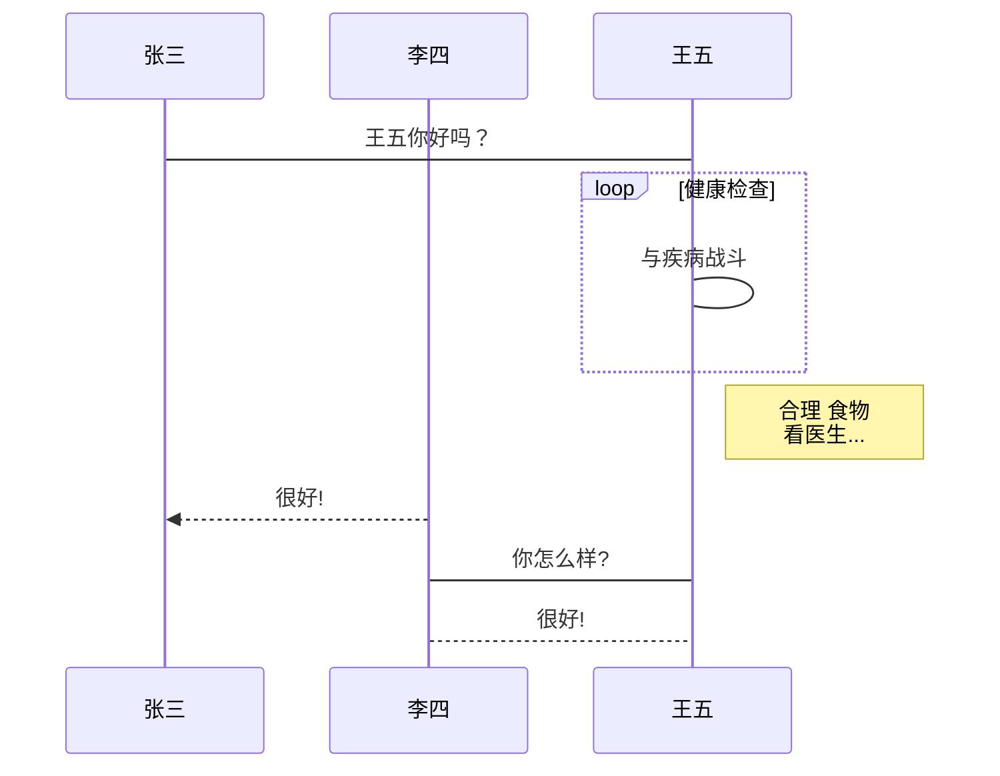
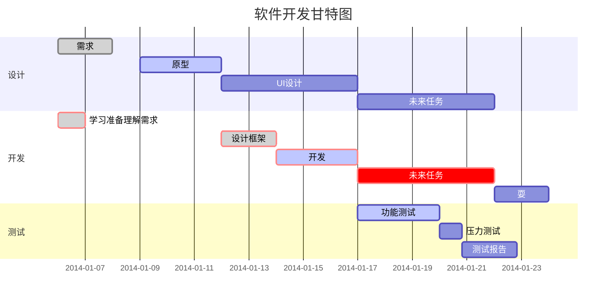

# Markdowm title

# First title 
## Second title 
### Third title 
#### Forth title 
##### Fifth title 
###### Sixth title
####### is not title, this's text

# Markdowm paragrah
add `two spaces` at the end to wrap  or `<BR>` (html)

or add a Blank line to restart a paragraph

# Markdowm fonts
*Italic*: \*italic\* \_italic\_    
**Bold**: \*\*bold\*\* \_\_bold\_\_    
***Bold Italic***: \*\*\*bold italica*\*\* \_\_\_bold italic\_\_\_

# Spilp line
\*\*\* or more
***
* * *
********

\-\-\- or more
---
-----------

# Strikethrough 
~~Strikethrough~~: \~\~strikethrough\~\~

# Underscore 
<u>Underscore</u>:  \<u>underscore\</u>  

# Footnote

this is a fontnote[^Footnote] `[^text]`

content for fontnote `[^text]:`  

[^Footnote]: this is a fontnote.

# Makdown list
* \*
+ or \+
- or  \-  

## number list
1. first `1.` 
2. second `2.`
3. third `3.`

## List nesting
1. first:
	- first nested element
	- second nested element
2. second:
	- first nested element
	- second nested element

# Markdown Block
> first block reference use `>follow a space`
> > second block reference use `> > `
> > > thrid block reference use `> > > `  

## Using list in block
> 1. first
> 2. second
> + first
> - second

## Using block in list
* first
	> block one  
	> block two
* second

# Markdown Code 
`Code`: \`code\`

## Code block 
	this is a code block
	this use four spaces or a tab

```
or use ```  ``` surround a code block
```

# Markdown Link  
[my github link](https://github.com/KuringMIN/) : use `[text](weblink)`

<https://github.com/KuringMIN>: or use `<link>` surround a link

## Advanced link
This link use 1 as network variables [Google][1] `[Google][1]`   
This link use github as network variables [Github][github] `[Github][github]`   
```
use [name][variable]
then assign to variable at the end of the document
use [variable]: the_link_to_web
[1]: https://www.google.com/  
[github]: https://www.github.com/
```

[1]: https://www.google.com/  
[github]: https://www.github.com/

# Markdown Image 


```
Format: 
```

# Markdown Table

| :-Align left | :-:Align center | -: Align right |
|:-------------|:---------------:|---------------:|
| cell         |       cell      |           cell |
| cell         |       cell      |           cell |

``` 
| :-Align left | :-:Align center | -: Align right |
|:-------------|:---------------:|---------------:|
| cell         |       cell      |           cell |
| cell         |       cell      |           cell |
```

# Markdown Advanced Skills

## Support HTML Element
<kbd>kbd</kbd> : keyboard `<kbd>text</kbd>`   
<b>bold</b>    : bold `<b>text</b>`   
<i>italic</i>  : italic `<i>text</i>`  
<em>em</em>    : italic `<em>text</em>`  
<sup>sup</sup> : Superscript `<sup>text</sup>`  
<sub>sub</sub> : Subscript `<sub>text</sub>`
<br>br</br>    : wrap `<br>text</br>`
<!--Annotation--> : `<\!--Annotation-->`
<center>center</center>  

```
Format: <\img src="url" alt="some_text">`
```


## Tex&LaTex
$\int_{-\infty}^{\infty} \frac{1}{x^2}dx$
$$
\int_{-\infty}^{\infty} \frac{1}{x^2}dx
$$
``` 
$Tex in line$
$$
Tex in block
$$
```

### Mermaid
1、横向流程图源码格式：


2、竖向流程图源码格式：


3、标准流程图源码格式：

```flow
st=>start: 开始框
op=>operation: 处理框
cond=>condition: 判断框(是或否?)
sub1=>subroutine: 子流程
io=>inputoutput: 输入输出框
e=>end: 结束框
st->op->cond
cond(yes)->io->e
cond(no)->sub1(right)->op
```
4、标准流程图源码格式（横向）：

```flow
st=>start: 开始框
op=>operation: 处理框
cond=>condition: 判断框(是或否?)
sub1=>subroutine: 子流程
io=>inputoutput: 输入输出框
e=>end: 结束框
st(right)->op(right)->cond
cond(yes)->io(bottom)->e
cond(no)->sub1(right)->op
```
5、UML时序图源码样例：

```sequence
对象A->对象B: 对象B你好吗?（请求）
Note right of 对象B: 对象B的描述
Note left of 对象A: 对象A的描述(提示)
对象B-->对象A: 我很好(响应)
对象A->对象B: 你真的好吗？
```
6、UML时序图源码复杂样例：

```sequence
Title: 标题：复杂使用
对象A->对象B: 对象B你好吗?（请求）
Note right of 对象B: 对象B的描述
Note left of 对象A: 对象A的描述(提示)
对象B-->对象A: 我很好(响应)
对象B->小三: 你好吗
小三-->>对象A: 对象B找我了
对象A->对象B: 你真的好吗？
Note over 小三,对象B: 我们是朋友
participant C
Note right of C: 没人陪我玩
```
7、UML标准时序图样例：


8、甘特图样例：



