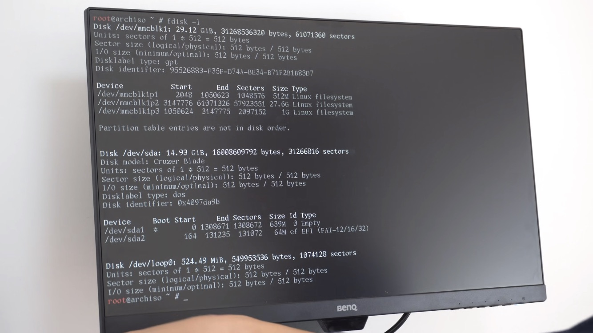
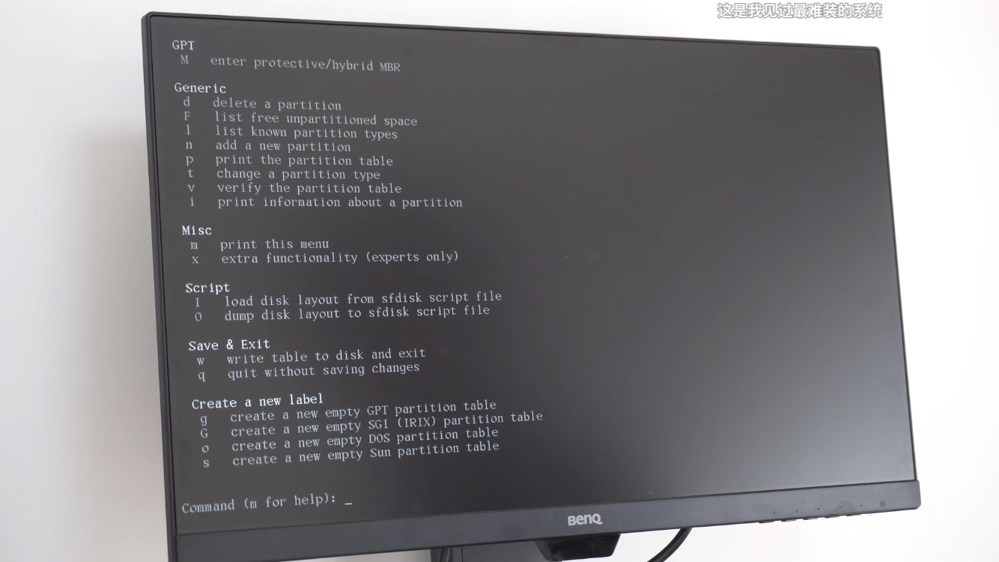
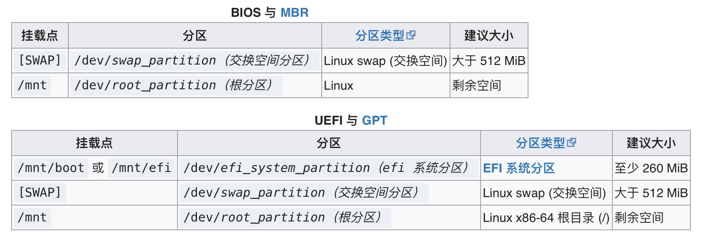
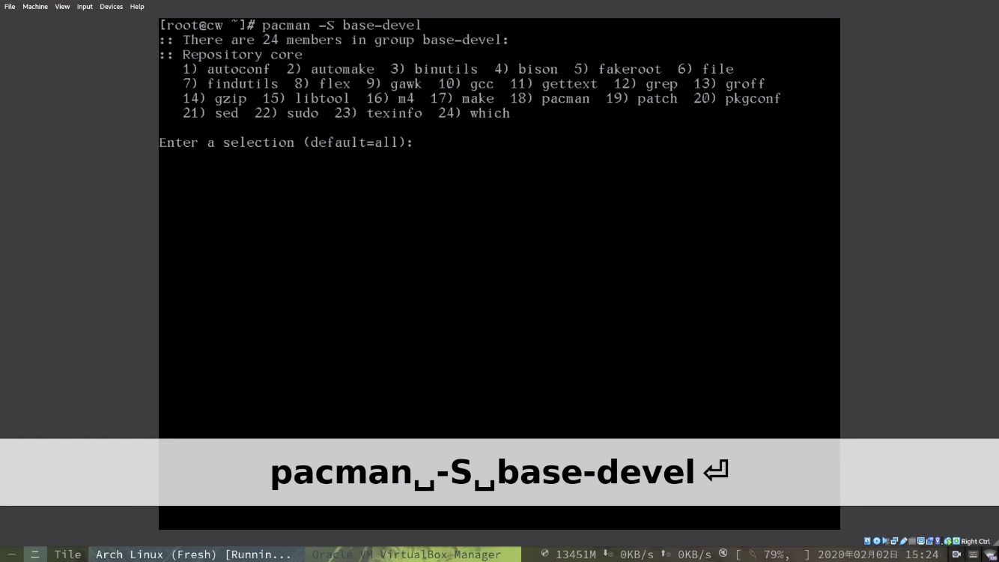

# ArchLinux 安装教程
some links
- [Installation guide (简体中文)](https://wiki.archlinux.org/index.php/Installation_guide_(简体中文))

- [【残酷难度】最全Arch Linux安装教程——打造真正属于你的操作系统](https://b23.tv/59Cfms)

# 一、u盘命令行安装下的基本配置

## 1.更改字体

`setfont /usr/share/kbd/consolefonts/LatGrkCyr-12x22.psfu.gz`

## 2.更改键盘布局

`loadkeys colemak`

互换ESC和Caps_Lock

`vim keys.conf`

```
keycode 1 = Caps_Lock
keycode 58 = Escape
```

加载 `keys.conf`文件：`loadkeys keys.conf`

## 3.vim简单配置

`vim .vimrc`

```
syntax on
noremap n h
noremap u k
noremap e j
noremap i l
noremap N 0
noremap U 5k
noremap E 5j
noremap I $
noremap l u
noremap k i
noremap K I
noremap ; :
noremap S :w<CR>
noremap Q :q<CR>
```

## 4.网络连接

1. 查看可连接互联网设备：`ip link`
2. 启用无线网设备：`ip link set wlan0 up`
3. 查看可连接互联网设备：`ip link`
4. 查看附近Wi-Fi：`iwlist wlan0 scan`
5. 过滤扫描出的Wi-Fi：`iwlist wlan0 scan | grep ESSID`
6. 生成连接互联网配置文件`wpa_passphrase`：`wpa_passphrase 网络 密码 > 文件名(internet.conf)`
7. 编辑配置文件：`vim internet.conf`
8. `wpa_supplicant` 连接互联网：`wpa_supplicant -c internet.conf -i wlan0 &`
9. ping下互联网：`ping baidu.com`
10. 动态分配IP地址：`dhcpcd &`
11. ping下互联网：`ping baidu.com`

## 5.同步系统时间

`timedatectl set-ntp true`

---

# 二、系统分区

## 1.查看硬件设备

`fdisk -l`



up主将要覆盖 `Disk /dev/mmcblk1` 整个分区



## 2.分区

1. `fdisk`磁盘工具分区：`fdisk /dev/mmcblk1`
2. `p`：打印出来该磁盘所有分区情况
3. `g`：创建新的`GTP`分区
4. `p`：打印出来该磁盘所有分区情况
5. `m`：找下帮助
6. `n`：创建系统引导分区给`/mnt/boot`
7. `n`：创建交换空间分区给`[SWAP]`
8. `n`：创建系统主分区给`/mnt`
9. `p`：打印出来该磁盘所有分区情况
10. `w`：保存分区



## 3.定义分区格式

1. 引导分区格式必须是`FAT`格式：`mkfs.fat -F32 /dev/mmcblk1p1`
2. 制作系统主分区格式`ext4`：`mkfs.ext4 /dev/mmcblk1p2`
3. 制作SWAP分区格式：`mkswap /dev/mmcblk1p3`
4. 挂载SWAP：`swapon /dev/mmcblk1p3`

## 4.配置pacman软件源

`vim /etc/pacman.conf`

> 打开Color、找到community...
> 

```
## 中科大
Server = https://mirrors.ustc.edu.cn/archlinux/$repo/os/$arch

## 清华大学

Server = https://mirrors.tuna.tsinghua.edu.cn/archlinux/$repo/os/$arch

## 163

Server = http://mirrors.163.com/archlinux/$repo/os/$arch

## aliyun

Server = http://mirrors.aliyun.com/archlinux/$repo/os/$arch
```

进入`/etc/pacman.d/mirrorlist`文件

> vim /etc/pacman.d/mirrorlist 或者快捷键gf跳转到路径下的文件
> 

找到中国大陆的服务器，剪切粘贴到列表最前端

> 用vim录制宏快捷操作
> 

```
进行宏录制：
1.把光标定位在第一行；
2.在normal模式下输入qa(当然也可以输入qb, qc, etc，这里的a, b, c是指寄存器名称，vim会把录制好的宏放在这个寄存器中)(PS：如果不知道什么是vim的寄存器，请自行放狗搜之)；
3.正常情况下，vim的命令行会显示“开始录制”的字样，这时候，把光标定位到第一个字符（按0或者|），再按x删除，按j跳到下一行；
4.normal模式下输入q，结束宏录制。
在normal模式下输入@a，以播放我们刚录制好的存在寄存器a中的宏
输入7@a，执行7次宏。（PS：在命令前面加数字，就是代表要执行这个命令多少次）

/^\n
/China
进入visual模式，删除china两行，到最顶行gg
/^\n
p 粘贴
q 停止录制
```

---

# 三、安装ArchLinux

## 1.在当前u盘命令行操作环境将系统挂载到相应分区里

1. 查看磁盘信息：`fdisk -l`
2. 将系统根目录`/mnt`挂载到我们为系统创建的根分区里`/dev/mmcblk1q2`：`mount /dev/mmcblk1q2 /mnt`
3. 用`ls`查看`/mnt`里面有什么：`ls /mnt`
4. 在`/mnt`目录下创建`/boot`目录：`mkdir /mnt/boot`
5. 将系统启动目录`/mnt/boot`挂载到我们为系统创建的引导分区里`/dev/mmcblk1q1`：`mount /dev/mmcblk1q1 /mnt/boot` 

```
挂载分区
将根磁盘卷 挂载 到 /mnt，例如：

# mount /dev/root_partition /mnt
然后使用 mkdir(1) 创建其他剩余的挂载点（比如 /mnt/efi）并挂载其相应的磁盘卷。

如果你创建了一个 swap 交换空间卷，请使用 swapon(8) 启用它：

# swapon /dev/swap_partition（交换空间分区）
稍后 genfstab(8) 将自动检测挂载的文件系统和交换空间。
```

## 2.开始安装系统

1. 使用 **[pacstrap](https://git.archlinux.org/arch-install-scripts.git/tree/pacstrap.in)** 脚本，安装 **[base](https://www.archlinux.org/packages/?name=base)** 软件包和 Linux **[内核](https://wiki.archlinux.org/index.php/Kernel)**以及常规硬件的固件到`/mnt`目录：`pacstrap /mnt base linux linux-firmware vim` 
2. 生成`fstab`文件：`genfstab -U /mnt >> /mnt/etc/fstab`

---

# 四、配置系统

## 1.同步时区

1. 进入安装好的ArchLinux系统：`arch-chroot /mnt`
2. 创建时区链接到`/etc/localtime`：`ln -sf /usr/share/zoneinfo/Asia/Shanghai /etc/localtime`
3. 同步时间：`hwclock --systohc`

## 2.本地化

1. `vim /etc/locale.gen`
2.  找到地区`en_US.UTF-8 UTF-8,zh_CN.UTF-8 UTF-8`取消注释、保存退出
3. 根据步骤1修改的配置文件生成本地化的东西：`locale-gen`

### 2.1修改语言

1. `vim /etc/locale.conf`
2. 写入语言`LANG=en_US.UTF-8`、保存退出

### 2.2重新为系统配置键盘布局

1. `vim /etc/vconsole.conf`
2. 写入`KEYMAP=colemak`;`keycode 1 = Caps_Lock`;`keycode 58 = Escape`保存退出

### 2.3网络配置

1. 主机名`vim /etc/hostname`
2. 写入名字`mk`保存退出
3. `vim /etc/hosts`

```
127.0.0.1	localhost
::1		localhost
127.0.1.1	mk.localdomain mk
```

### 2.4更改root密码

1. `passwd`;0

### 2.5安装系统引导、微码等软件

1. 安装grub：`pacman -S grub efibootmgr intel-ucode os-prober`
2. 在引导目录下创建grub：`mkdir /boot/grub`
3. 生成grub配置文件：`grub-mkconfig > /boot/grub/grub.cfg`
4. 查看系统架构：`uname -m`
5. 生成相应架构的grub启动配置：`grub-install --target=x86_64-efi --efi-directory=/boot` 

<aside>
💡 bios引导：`grub-install —-target=i386-pc /dev/sda`

</aside>

### 2.6安装软件

1. 安装一些必要软件：`pacman -S neovim vi vim zsh iw wpa_supplicant dhcpcd git base-devel`
2. 退出chroot：`exit`
3. 关掉网络软件：`killall wpa_supplicant dhcpcd`
4. 卸载挂载：`umount`
5. 重启系统：`reboot`
6. 拔掉u盘

---

# 五、进入系统

## 1.改字体

`setfont /usr/share/kbd/consolefonts/LatGrkCyr-12x22.psfu.gz`

```
先ls /usr/share/kbd/consolefonts查看有哪些字体。
临时设置的方法：
setfont lat2-10
永久设置的方法：
在/etc/vconsole.conf中的添加或修改这一句
FONT=lat2-10
```

注意：此法仅适用于Archlinux，参考Archwiki：[https://wiki.archlinux.org/index.php/Console_fonts](https://wiki.archlinux.org/index.php/Console_fonts)

## 2.改键位

## 3.联网

1. 查看可连接互联网的设备：`ip link`
2. 启用无线网设备：`ip link set wlan0 up`
3. 查看可连接互联网的设备：`ip link`
4. 查看附近Wi-Fi：`iwlist wlan0 scan`
5. 过滤扫描出的Wi-Fi：`iwlist wlan0 scan | grep ESSID`
6. 生成连接互联网配置文件`wpa_passphrase`：`wpa_passphrase 网络 密码 > 文件名(internet.conf)`
7. 编辑配置文件：`vim internet.conf`
8. `wpa_supplicant` 连接互联网：`wpa_supplicant -c internet.conf -i wlan0 &`
9. ping下互联网：`ping baidu.com`
10. 动态分配IP地址：`dhcpcd &`
11. ping下互联网：`ping baidu.com`

## 4.更新系统

`pacman -Syu`

换过源：`pacman -Syyu`

## 5.安装一些软件

1. `man`命令查看命令功能：`pacman -S man`
2. `base-devel`一些基本软件



## 6.添加用户

1. `useradd`命令：`-m` `-G`
2. 添加一个用户并放在david用户组里：`useradd -m -G wheel david`
3. 为用户添加密码：`passwd david`
4. 添加权限：`visudo`
5. 取消`%wheel ALL=(ALL) ALL`前的注释
6. 登出`root`用户：`exit`
7. 登陆`david`用户
8. 更新系统：`sudo pacman -Syyu`

---

## 7.安装图形界面

1. 安装`xorg`服务器：`sudo pacman -S xorg xorg-server`
2. 安装deepin窗口管理器：`sudo pacman -S deepin deepin-extra`
3. 启动窗口管理器(登陆管理器)`display manager`：`sudo pacman -Qs lightdm`
4. 配置窗口登陆管理器：`vim /etc/lightdm/lightdm.conf`
5. 找到`greeter-session=example-gtk-gnome`,取消注释，`example-gtk-gnome`改成`lightdm-deepin-greeter`，保存退出
6. 设置登陆管理器开机自启：`sudo systemctl enable lightdm`
7. 直接启动登陆管理器：`sudo systemctl start lightdm`
8. 使用deepin窗口管理器

## 8.安装一些软件

### 8.1浏览器

`google-chrome`、`firefox`

### 8.2 AUR Help—yay 软件管理器

### 8.3 TLP电池管理软件

### 8.4 字体

[theniceboy/.config](https://github.com/theniceboy/.config)

### 8.5网易云音乐netease-cloud-music
